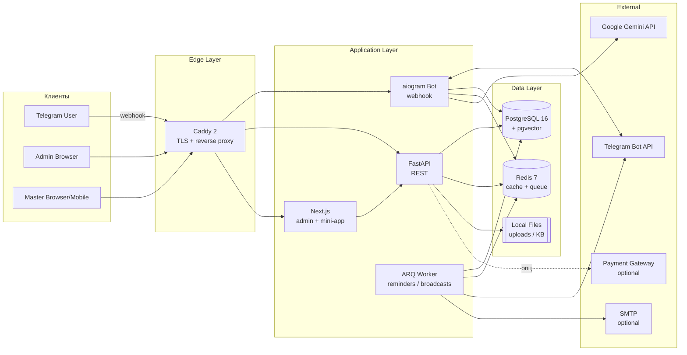
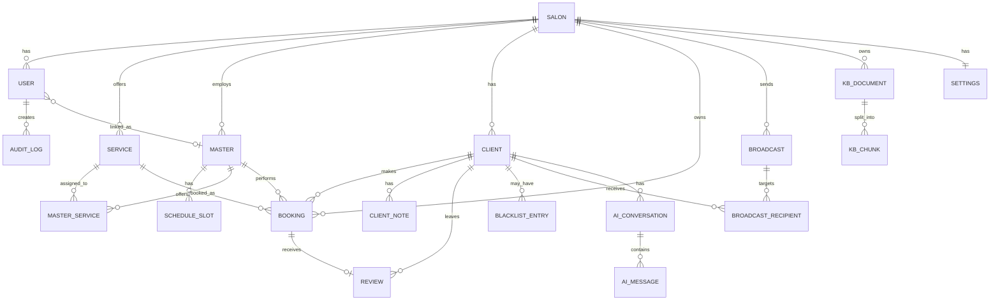
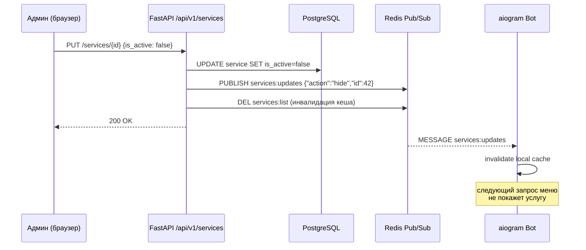
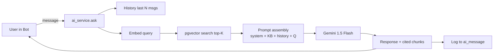

# Hunger Platform — Мастер-спецификация

> **Платформа**: Универсальный шаблон для салонов красоты.
> **Продукт**: Telegram-бот (с Mini App) + веб-админка.
> **Модель продажи**: одноразовая лицензия, исходники целиком, single-tenant (1 инсталляция = 1 салон).
> **Автор спеки**: v1.0 — 2026-04-18.

---

## 0. Содержание

1. [Видение и бизнес-контекст](#1-видение-и-бизнес-контекст)
2. [Технологический стек](#2-технологический-стек)
3. [Архитектура системы](#3-архитектура-системы)
4. [Модель данных](#4-модель-данных)
5. [Роли и права доступа](#5-роли-и-права-доступа)
6. [Функционал Telegram-бота](#6-функционал-telegram-бота)
7. [Функционал админ-панели](#7-функционал-админ-панели)
8. [AI-консультант](#8-ai-консультант)
9. [Интернационализация (4 языка)](#9-интернационализация-4-языка)
10. [Интеграции](#10-интеграции)
11. [Безопасность](#11-безопасность)
12. [Деплой и DevOps](#12-деплой-и-devops)
13. [Тестирование и качество](#13-тестирование-и-качество)
14. [Нефункциональные требования](#14-нефункциональные-требования)
15. [Критерии приёмки](#15-критерии-приёмки-acceptance)

---

## 1. Видение и бизнес-контекст

**Проблема:** Салоны красоты теряют клиентов из-за ручной записи через мессенджеры. Готовые SaaS-решения берут % с брони или подписку, что невыгодно.

**Решение:** Шаблон «под ключ» — салон покупает один раз, разворачивает на своём VPS, платит только за хостинг (5–10 €/мес).

**Уникальные ценности:**
- Бронирование из Telegram (без приложений).
- AI-консультант обучается на базе салона (RAG).
- Всё управление из одной админки — никаких pgAdmin/phpMyAdmin.
- 4 языка из коробки (EN, BG, UK, RU).
- Полная финансовая аналитика (выручка, ЗП мастеров, no-show).
- Чёрный список, штрафы, лояльность.

**Целевая ЦА:** Салоны 2–15 сотрудников в Болгарии, Украине, русскоязычных рынках ЕС.

**Out of scope v1.0:**
- Мультисалонная сеть под одной панелью (это не single-tenant).
- Групповые услуги (услуги «в 4 руки»).
- Интеграция с онлайн-кассами (ФЗ-54 и т.п.).
- Публичный веб-сайт салона (только Mini App).

---

## 2. Технологический стек

### 2.1. Backend

| Компонент | Технология | Обоснование |
|---|---|---|
| Runtime | Python 3.12 | Современные типы, скорость разработки |
| Web framework | FastAPI 0.115+ | Async, авто-OpenAPI, Pydantic v2 |
| Telegram bot | aiogram 3.15+ | FSM, middlewares, i18n, актуальная либа |
| ORM | SQLAlchemy 2 (async) | Стандарт |
| Миграции | Alembic | Автогенерация из моделей |
| Очереди | ARQ (Redis) | Лёгкая альтернатива Celery |
| Валидация | Pydantic v2 | Встроено в FastAPI |
| Auth | python-jose (JWT) + passlib[bcrypt] | Стандарт |
| HTTP клиент | httpx | Async |
| Логи | structlog + loguru | Структурированные JSON-логи |
| i18n | Babel + fluent (для бота) | Профессиональная локализация |

### 2.2. Frontend (админка + Mini App)

| Компонент | Технология |
|---|---|
| Framework | Next.js 14 (App Router) |
| Language | TypeScript 5.4+ (strict) |
| Styling | Tailwind CSS 3.4 |
| UI kit | shadcn/ui (Radix primitives) |
| State | Zustand + TanStack Query |
| Forms | react-hook-form + zod |
| Charts | Recharts |
| Tables | TanStack Table v8 |
| i18n | next-intl |
| Icons | lucide-react |
| Date | date-fns + date-fns-tz |

### 2.3. Инфраструктура

| Компонент | Технология |
|---|---|
| БД | PostgreSQL 16 |
| Кеш/очереди | Redis 7 |
| Прокси | Caddy 2 (авто-TLS) |
| Контейнеры | Docker + Docker Compose |
| CI | GitHub Actions |
| Хранилище файлов | Локальный диск (volume), опционально S3 |
| Мониторинг v1 | Встроенный `/healthz` + Uptime Kuma (опц.) |

### 2.4. AI

| Компонент | Технология |
|---|---|
| LLM | Google Gemini 1.5 Flash (бесплатный тариф: 15 RPM, 1500 RPD) |
| Embeddings | Google text-embedding-004 |
| Vector store | pgvector (расширение Postgres) |
| RAG оркестрация | Самописная на LangChain-минимуме (без лишних зависимостей) |

**Почему Gemini Flash:** 1) бесплатный тариф покрывает малый/средний салон; 2) поддерживает все 4 языка (включая украинский и болгарский); 3) быстрый (Flash). Архитектура заложена так, что можно переключить на OpenAI/Claude/Ollama сменой одного adapter-модуля.

---

## 3. Архитектура системы

### 3.1. Высокоуровневая диаграмма



### 3.2. Процессы (процесс-модель)

В `docker-compose.yml` поднимается **шесть контейнеров**:

1. `caddy` — TLS + reverse proxy, на 80/443
2. `postgres` — БД
3. `redis` — кеш/очереди
4. `api` — FastAPI (uvicorn), REST + webhook-эндпоинт для бота
5. `worker` — ARQ воркер для напоминаний/рассылок
6. `web` — Next.js production server (`next start`)

Бот встроен в `api`-контейнер как отдельная aiogram-app, принимающая webhook от Telegram.

### 3.3. Структура репозитория

```
hunger-platform/
├── backend/
│   ├── app/
│   │   ├── main.py                # FastAPI entry
│   │   ├── config.py              # Pydantic settings
│   │   ├── deps.py                # DI
│   │   ├── api/                   # REST routes
│   │   │   ├── v1/
│   │   │   │   ├── auth.py
│   │   │   │   ├── clients.py
│   │   │   │   ├── masters.py
│   │   │   │   ├── services.py
│   │   │   │   ├── bookings.py
│   │   │   │   ├── schedule.py
│   │   │   │   ├── broadcasts.py
│   │   │   │   ├── stats.py
│   │   │   │   ├── settings.py
│   │   │   │   ├── knowledge.py   # AI KB
│   │   │   │   ├── blacklist.py
│   │   │   │   └── uploads.py
│   │   ├── bot/
│   │   │   ├── __init__.py
│   │   │   ├── routers/           # aiogram routers по фичам
│   │   │   │   ├── start.py
│   │   │   │   ├── language.py
│   │   │   │   ├── booking.py
│   │   │   │   ├── my_bookings.py
│   │   │   │   ├── profile.py
│   │   │   │   ├── ai_consult.py
│   │   │   │   ├── review.py
│   │   │   │   └── about.py
│   │   │   ├── keyboards/
│   │   │   ├── states.py          # FSM states
│   │   │   ├── middlewares/
│   │   │   │   ├── i18n.py
│   │   │   │   ├── user.py        # auto-create user
│   │   │   │   └── throttle.py
│   │   │   └── texts/             # .ftl files (fluent)
│   │   ├── models/                # SQLAlchemy
│   │   ├── schemas/               # Pydantic
│   │   ├── services/              # бизнес-логика
│   │   │   ├── booking_service.py
│   │   │   ├── schedule_service.py
│   │   │   ├── stats_service.py
│   │   │   ├── broadcast_service.py
│   │   │   ├── ai_service.py
│   │   │   ├── payment_service.py
│   │   │   └── notification_service.py
│   │   ├── workers/
│   │   │   ├── reminders.py
│   │   │   ├── broadcasts.py
│   │   │   └── indexer.py         # RAG indexing
│   │   ├── db/
│   │   │   ├── base.py
│   │   │   └── session.py
│   │   └── core/
│   │       ├── security.py
│   │       ├── permissions.py
│   │       └── exceptions.py
│   ├── alembic/
│   ├── tests/
│   ├── pyproject.toml
│   └── Dockerfile
│
├── frontend/
│   ├── src/
│   │   ├── app/                   # Next.js App Router
│   │   │   ├── (auth)/login/page.tsx
│   │   │   ├── (admin)/
│   │   │   │   ├── layout.tsx
│   │   │   │   ├── dashboard/page.tsx
│   │   │   │   ├── clients/page.tsx
│   │   │   │   ├── clients/[id]/page.tsx
│   │   │   │   ├── masters/page.tsx
│   │   │   │   ├── services/page.tsx
│   │   │   │   ├── bookings/page.tsx
│   │   │   │   ├── schedule/page.tsx
│   │   │   │   ├── broadcasts/page.tsx
│   │   │   │   ├── statistics/page.tsx
│   │   │   │   ├── blacklist/page.tsx
│   │   │   │   ├── ai/page.tsx
│   │   │   │   ├── settings/page.tsx
│   │   │   │   └── users/page.tsx   # staff accounts
│   │   │   ├── (master)/
│   │   │   │   ├── layout.tsx
│   │   │   │   ├── dashboard/page.tsx
│   │   │   │   ├── schedule/page.tsx
│   │   │   │   ├── clients/page.tsx
│   │   │   │   └── bookings/page.tsx
│   │   │   └── mini-app/            # Telegram Mini App routes
│   │   ├── components/
│   │   │   ├── ui/                  # shadcn primitives
│   │   │   ├── layout/
│   │   │   ├── forms/
│   │   │   ├── tables/
│   │   │   ├── charts/
│   │   │   └── calendar/
│   │   ├── features/                # domain modules
│   │   ├── lib/
│   │   │   ├── api.ts
│   │   │   ├── auth.ts
│   │   │   └── permissions.ts
│   │   ├── hooks/
│   │   ├── messages/                # i18n
│   │   │   ├── en.json
│   │   │   ├── ru.json
│   │   │   ├── uk.json
│   │   │   └── bg.json
│   │   ├── theme/                   # Premium Light + Premium Dark
│   │   │   ├── light.ts
│   │   │   ├── dark.ts
│   │   │   └── presets.ts
│   │   └── types/
│   ├── package.json
│   └── Dockerfile
│
├── deploy/
│   ├── docker-compose.yml
│   ├── docker-compose.prod.yml
│   ├── Caddyfile
│   ├── .env.example
│   └── scripts/
│       ├── install.sh
│       ├── backup.sh
│       └── update.sh
│
├── .cursor/
│   ├── rules/
│   │   ├── architecture.mdc
│   │   ├── backend.mdc
│   │   ├── frontend.mdc
│   │   ├── i18n.mdc
│   │   └── security.mdc
│   └── agents/
│       ├── code-reviewer.md
│       ├── test-writer.md
│       ├── i18n-checker.md
│       └── security-auditor.md
│
├── .github/
│   └── workflows/
│       ├── ci.yml
│       └── release.yml
│
├── docs/
│   ├── INSTALL.md
│   ├── ADMIN_GUIDE.md
│   └── MASTER_GUIDE.md
│
├── README.md
└── LICENSE
```

---

## 4. Модель данных

### 4.1. ER-диаграмма



### 4.2. Таблицы (основные поля)

**salon** (единственная запись — «этот салон»)
- `id`, `name`, `description`, `logo_url`, `cover_url`, `timezone`, `currency` (EUR/USD/UAH), `default_lang`, `license_key`, `created_at`

**settings** (1:1 с salon, JSON + отдельные колонки)
- `theme` (`premium_light` / `premium_dark`), `primary_color`, `prepayment_enabled` (bool), `prepayment_percent`, `cancellation_free_hours` (default 24), `late_cancellation_policy` (enum: `no_cancel`, `fine`, `blacklist`), `fine_amount`, `reminder_intervals` (array: `[24,2,0.5]`), `review_delay_hours` (2), `working_hours_default`, `booking_lead_time_minutes`, `booking_buffer_minutes`, `ai_enabled`, `ai_system_prompt`, `ai_model`, `ai_allow_booking` (false), `payment_provider_config` (jsonb)

**user** (сотрудники: owner/admin/master/reception)
- `id`, `email`, `password_hash`, `role` (enum), `first_name`, `last_name`, `avatar_url`, `phone`, `master_id` (FK, nullable — линк к записи master), `lang`, `is_active`, `last_login_at`, `created_at`

**master**
- `id`, `display_name`, `bio`, `photo_url`, `specialization`, `rating_avg`, `rating_count`, `color_hex` (для календаря), `sort_order`, `is_active`

**service**
- `id`, `category_id`, `name_i18n` (jsonb: `{en,ru,uk,bg}`), `description_i18n`, `duration_minutes`, `price`, `photo_url`, `is_active`, `sort_order`

**service_category**
- `id`, `name_i18n`, `icon`, `sort_order`

**master_service** (many-to-many)
- `master_id`, `service_id`, `price_override` (nullable), `duration_override` (nullable)

**schedule_slot** (рабочее время и блоки мастера)
- `id`, `master_id`, `type` (enum: `working`, `vacation`, `sick`, `block`, `break`), `starts_at`, `ends_at`, `recurrence` (jsonb: RRULE-подобное), `note`

**client**
- `id`, `tg_user_id` (unique), `tg_username`, `phone`, `first_name`, `last_name`, `birthday`, `lang`, `joined_at`, `source` (bot/manual), `total_bookings`, `total_revenue`, `no_show_count`, `last_visit_at`, `tags` (array)

**client_note** (главное — характер/предпочтения, «записка»)
- `id`, `client_id`, `author_user_id`, `content`, `pinned` (bool), `created_at`, `updated_at`

**booking**
- `id`, `client_id`, `master_id`, `service_id`, `starts_at`, `ends_at`, `status` (enum: `pending`, `confirmed`, `completed`, `cancelled_by_client`, `cancelled_by_salon`, `no_show`), `price`, `prepayment_amount`, `prepayment_status` (enum), `payment_provider_ref`, `notes`, `created_via` (bot/admin), `created_at`, `cancelled_at`, `cancellation_reason`

**review**
- `id`, `booking_id` (unique), `client_id`, `master_id`, `rating` (1-5), `comment`, `is_published` (bool — видна ли в статистике мастера), `created_at`

**blacklist_entry**
- `id`, `client_id` (unique), `reason`, `added_by_user_id`, `expires_at` (nullable), `created_at`

**broadcast**
- `id`, `title`, `message_i18n` (jsonb), `media_url`, `segment` (jsonb — фильтр), `status` (enum: `draft`, `scheduled`, `sending`, `sent`, `failed`), `scheduled_at`, `sent_at`, `created_by_user_id`, `stats` (jsonb: `{sent, delivered, read, clicked, failed}`)

**broadcast_recipient**
- `broadcast_id`, `client_id`, `status` (sent/delivered/failed), `error`, `sent_at`

**kb_document** (AI knowledge base)
- `id`, `title`, `source_type` (enum: `file`, `url`, `manual`), `source_ref`, `content`, `lang`, `created_at`

**kb_chunk** (куски для RAG)
- `id`, `document_id`, `content`, `embedding` (vector(768)), `token_count`, `position`

**ai_conversation**
- `id`, `client_id`, `started_at`, `ended_at`, `lang`, `token_in`, `token_out`

**ai_message**
- `id`, `conversation_id`, `role` (user/assistant/system), `content`, `created_at`, `cited_chunks` (int[])

**bot_visit_stat** (агрегируется из событий)
- `id`, `date`, `unique_visitors`, `new_joins`, `bookings_started`, `bookings_completed`, `bookings_abandoned`, `ai_sessions`

**audit_log**
- `id`, `user_id`, `action`, `entity_type`, `entity_id`, `payload` (jsonb), `ip`, `user_agent`, `created_at`

**session** (refresh tokens)
- `id`, `user_id`, `token_hash`, `expires_at`, `ip`, `user_agent`, `revoked_at`

### 4.3. Индексы (ключевые)

- `booking(master_id, starts_at)` — для быстрых проверок занятости.
- `booking(client_id, starts_at DESC)`.
- `client(tg_user_id)` UNIQUE.
- `kb_chunk USING ivfflat (embedding vector_cosine_ops)`.
- `schedule_slot(master_id, starts_at)`.
- `booking(status, starts_at)` — для напоминалок.

### 4.4. Seed-данные (демо для продажи)

Скрипт `backend/scripts/seed_demo.py`, создаёт: 1 owner, 1 admin, 3 мастеров, 12 услуг в 4 категориях, 20 клиентов, 50 бронирований (прошедших и будущих), 30 KB-записей. Демо-данные на 4 языках.

**Аккаунты, создаваемые seed-скриптом:**

| Роль | Email |
|---|---|
| Owner | `owner@adm-test.tech` |
| Admin | `admin@adm-test.tech` |
| Master | `master@adm-test.tech` |
| Reception | `reception@adm-test.tech` |

Пароль для всех аккаунтов берётся из переменной окружения `SEED_PASSWORD` (задаётся в `.env`).
Seed не создаёт клиентов, услуг и бронирований — только аккаунты и базовые данные салона.

**Данные салона:**
- `salon.name` = `Synchro`
- `salon.default_lang` = `ru`
- `app_domain` = `test-adm.tech`

> После первого входа под owner — смени пароли каждого аккаунта через «Сотрудники → Сбросить пароль».

---

## 5. Роли и права доступа

### 5.1. Матрица

| Функция | Owner | Admin | Master | Reception |
|---|:---:|:---:|:---:|:---:|
| Просмотр дашборда | ✅ | ✅ | свой | ✅ |
| CRUD мастеров | ✅ | ✅ | ❌ | ❌ |
| CRUD услуг | ✅ | ✅ | ❌ | ❌ |
| CRUD клиентов | ✅ | ✅ | только свои | ✅ |
| Просмотр всех броней | ✅ | ✅ | только свои | ✅ |
| Создать бронь вручную | ✅ | ✅ | свою | ✅ |
| Редактировать расписание | ✅ | ✅ | своё | ❌ |
| Рассылки | ✅ | ✅ | ❌ | ❌ |
| Финансы (выручка) | ✅ | ✅ | своя | ❌ |
| Блэклист | ✅ | ✅ | ❌ | ❌ |
| AI: обучение / промпт | ✅ | ✅ | ❌ | ❌ |
| Настройки салона | ✅ | ❌ | ❌ | ❌ |
| Управление сотрудниками | ✅ | ❌ | ❌ | ❌ |
| Audit log | ✅ | read | ❌ | ❌ |
| Смена темы (светлая/тёмная, topbar) | ✅ | ✅ | ✅ | ✅ |
| Брендинг салона (лого, акцентный цвет, …) | ✅ | ❌ | ❌ | ❌ |
| Заметки по клиенту | ✅ | ✅ | свои | ✅ |

**Backend enforcement:** все REST-эндпоинты защищены dep `Depends(require_roles([...]))`. Frontend прячет меню, но проверки дублируются на API.

### 5.2. Master → User линк

У мастера две сущности:
- `master` — публичный профиль (отображается в боте).
- `user` с `role='master'` и `master_id=<id>` — логин в панель.

Это разделение важно: можно иметь «фантомного» мастера без логина (например, мастер не пользуется панелью сам — за него работает ресепшен).

---

## 6. Функционал Telegram-бота

### 6.1. Глобальные правила UX

- На **любом** экране внизу есть кнопка `« Назад` (если не корень) и `🏠 В меню`.
- Клавиатура **всегда inline** (не reply), чтобы сохранялась чистая лента.
- Ответы бота **короткие**, с эмодзи (но без перебора).
- При ошибке — человекочитаемое сообщение + кнопка «Написать админу».
- Язык запоминается в `client.lang`, при смене — сразу переводится весь интерфейс.

### 6.2. Главное меню (после выбора языка)

```
🗓  Записаться
📋  Мои записи
💬  Консультант AI
ℹ️  О салоне
👤  Мой профиль
🌐  Язык / Language
```

(Если AI выключен админом — пункт «Консультант AI» скрыт.)

### 6.3. Сценарии — см. отдельный файл `02_BOT_FLOWS.md`

Там разрисованы все FSM-диаграммы записи, отмены, AI-консультации и т.д.

### 6.4. Telegram Mini App (Web App)

Внутри бота есть кнопка `🎨 Открыть салон` → открывается Mini App с:
- Главная: витрина услуг с фото.
- Мастера: карточки с фото, рейтингом, био.
- Календарь: выбор даты/слота в красивом UI.
- Галерея работ (опц. v1.1).

Mini App — это Next.js роут `/mini-app/*`, аутентификация через `initData` Telegram (HMAC-проверка).

---

## 7. Функционал админ-панели

Детали — в `04_ADMIN_PANEL.md`. Здесь высокоуровневый список страниц.

### 7.1. Навигация (admin / owner)

- **Дашборд** — KPI, график записей, топ-мастер, последние события.
- **Бронирования** — календарь + таблица, фильтры, ручное создание.
- **Клиенты** — таблица, поиск, карточка клиента с заметками, историей, блэклистом.
- **Мастера** — CRUD, фото, услуги, расписание, статистика.
- **Услуги** — категории и услуги с фото, цена, длительность.
- **Расписание** — общий календарь всех мастеров, drag'n'drop.
- **Рассылки** — шаблоны, сегменты, планировщик.
- **Статистика** — полная аналитика (см. 7.5).
- **AI** — база знаний, промпт, история диалогов.
- **Блэклист** — список, добавить/удалить вручную.
- **Сотрудники** (only owner) — CRUD аккаунтов.
- **Настройки** (only owner) — бренд, валюта, ТЗ, язык по умолчанию, политика отмен, предоплата, платёжный провайдер, Telegram токен. Светлая/тёмная тема UI — отдельно, переключение в topbar (см. §5.1).
- **Audit log** (only owner) — кто что менял.

### 7.2. Навигация (master)

- **Мой дашборд** — записи сегодня, неделя, моя выручка.
- **Моё расписание** — мой календарь, могу ставить выходные/блоки.
- **Мои клиенты** — мои постоянные, с заметками.
- **Мои записи** — список/календарь.
- **Статистика** — моя личная.
- **Профиль** — фото, био, специализация.

### 7.3. Навигация (reception)

- **Бронирования**, **Клиенты**, **Расписание** (read only), **Услуги** (read only).

### 7.4. Карточка клиента (очень важно)

Как ты указал — «записка» по клиенту. Карточка содержит:

1. **Шапка:** фото (аватар tg), имя, телефон, Telegram @handle, ДР, язык, теги, флаг «в блэклисте».
2. **KPI блок:** всего записей, выручка, no-show, последний визит.
3. **Заметки (pinned сверху):** свободный текст, несколько записок, автор каждой, дата. Можно «закрепить» важную. Редактирует admin/owner/reception и мастер (только для своих).
4. **История записей:** таблица с фильтрами по статусу.
5. **Отзывы:** что оставлял.
6. **AI-диалоги** (опц., свёрнуто).
7. **Кнопки:** «Записать», «Добавить заметку», «В блэклист», «Отправить личное сообщение в ТГ».

### 7.5. Статистика — полный список метрик

**Бот:**
- Уникальных посетителей бота (день/неделя/месяц).
- Новых подписчиков (`/start`).
- Начали запись, но не завершили (брошенные воронки) — в %.
- Конверсия «посетил → записался».
- Сессий AI-консультанта, средняя длина.

**Бронирования:**
- Всего, подтверждённых, отменённых, no-show.
- Распределение по часам суток и дням недели (heatmap).
- Средний чек.
- LTV клиента.
- Retention (повторные визиты через 30/60/90 дней).

**Мастера:**
- По каждому: выручка, кол-во записей, средний рейтинг, % отмен, загрузка (%), топ-услуга.
- **Самый востребованный мастер** — ранжирование.
- Зарплата (на основании % ставки из настроек мастера).

**Услуги:**
- Топ-услуги по выручке и кол-ву.
- Мёртвые услуги (0 записей за 30 дней).

**Финансы:**
- Выручка по периодам с графиком.
- Прогноз (простой линейный).
- Экспорт в XLSX и PDF.

### 7.6. Рассылки

**Сегменты (все «какие только можно»):**
- Все клиенты.
- Новые за период.
- Не приходили N дней.
- С ДР на неделе/месяце.
- Брали услугу X.
- Были у мастера Y.
- VIP (топ-N% по выручке).
- Спящие (были 1 раз).
- Регулярные (≥ N раз).
- По тегам.
- По языку.
- No-show.
- В блэклисте (исключить).

**Редактор:**
- WYSIWYG с эмодзи-пикером.
- Превью (mobile / desktop tg).
- Медиа: фото/видео/документ.
- Inline-кнопки.
- Перевод на 4 языка (с AI-автопереводом как черновик).
- Плановая отправка.
- Лимит TG: 30 msg/sec — встроенный rate limiter.
- Метрики: sent / delivered / blocked / clicked.

### 7.7. AI (для админа)

**Страница «AI → База знаний»:**
- Список документов (манипуляция: прайс, FAQ, правила салона, про каждую услугу).
- Загрузка PDF, DOCX, TXT, URL. Автосплит на чанки + эмбеддинги.
- Инлайн-редактор текстовых записей.
- Тест-чат справа от списка: «спроси AI как клиент» → видно ответ + какие чанки процитированы.

**Страница «AI → Промпт»:**
- Системный промпт (редактируемый, i18n).
- Примеры Q&A (few-shot).
- Температура.
- Включить/выключить AI глобально.
- Разрешить AI записывать (v1 — выключено).

**Страница «AI → Диалоги»:**
- Лог разговоров клиентов с AI (с паджинацией и поиском).
- Пометить «плохой ответ» → попадает в improvement queue.

### 7.8. Управление услугами (Services CRUD)

#### 7.8.1. Страница «Услуги» в админке

Доступна ролям **Owner** и **Admin**. Содержит:

- **Список категорий** в левой колонке (drag'n'drop порядок). Кнопка «+ Добавить категорию».
- **Список услуг** в правой части (карточки по сетке). Кнопка «+ Добавить услугу».

**Карточка услуги** показывает:
- Название (текущий язык интерфейса)
- Цена + длительность
- Количество мастеров, которые выполняют услугу
- Количество записей за последние 30 дней
- **Тогл «Видна в боте»** (зелёный = активна / серый = скрыта)
- Кнопки **«Изменить»** и **«Удалить»**

#### 7.8.2. Форма добавления / редактирования услуги

Поля:
- Название на 4 языках (табы: EN / RU / UK / BG)
- Описание на 4 языках (textarea)
- Категория (select)
- Цена (числовое поле, валюта из настроек)
- Длительность, минуты
- Фото (upload, превью)
- Мастера, выполняющие услугу (multi-select) — с возможностью переопределить цену/длительность per-master
- Порядок сортировки (число)
- Флаг «Активна в боте» (по умолчанию — включён)

Кнопка «Автоперевод» рядом с языковым табом генерирует черновик через Gemini и заполняет остальные три языка, оставляя их редактируемыми.

#### 7.8.3. Удаление услуги

Двухшаговое подтверждение. Если у услуги есть **будущие бронирования** — показывается предупреждение с их числом. Удаление запрещено (кнопка «Удалить» неактивна) пока есть `status = 'confirmed'` записи. Мягкое удаление: `is_active = false` + `deleted_at = now()`. Из бота исчезает немедленно.

#### 7.8.4. Скрытие услуги («Скрыта в боте»)

Тогл на карточке — атомарная операция:
1. Записывает `service.is_active = false` в PostgreSQL.
2. Публикует событие в Redis channel `services:updates`: `{"action": "hide", "service_id": <id>}`.
3. Инвалидирует ключ кеша `services:list` в Redis.
4. Бот получает сообщение через Pub/Sub и обновляет свой in-memory кеш (или сразу делает запрос к БД).

Услуга перестаёт отображаться в меню бота **в течение < 1 секунды** (время Pub/Sub round-trip). Уже начатые сессии бронирования с этой услугой не ломаются — если клиент уже дошёл до выбора мастера, процесс завершается. На новых шагах услуга не предлагается.

#### 7.8.5. Синхронизация бота с админкой — архитектура



**Реализация на стороне бота:**

```python
# backend/app/bot/services_cache.py
import asyncio, json
from redis.asyncio import Redis

CHANNEL = "services:updates"
_cache: dict = {}  # {service_id: ServiceDTO}

async def subscribe_to_updates(redis: Redis):
    async with redis.pubsub() as ps:
        await ps.subscribe(CHANNEL)
        async for msg in ps.listen():
            if msg["type"] == "message":
                event = json.loads(msg["data"])
                if event["action"] in ("hide", "update", "delete"):
                    _cache.pop(event["id"], None)
                elif event["action"] == "flush":
                    _cache.clear()

async def get_active_services(redis: Redis, db) -> list:
    if not _cache:
        rows = await db.execute(
            "SELECT * FROM service WHERE is_active=true ORDER BY sort_order"
        )
        for row in rows:
            _cache[row.id] = row
    return list(_cache.values())
```

Функция `subscribe_to_updates` запускается как фоновая задача при старте бота (`on_startup` dispatcher hook).

#### 7.8.6. Синхронизированные поля (что обновляется мгновенно)

| Поле | Действие | Эффект в боте |
|---|---|---|
| `is_active = false` | Скрыть | Услуга исчезает из меню бронирования |
| `is_active = true` | Показать | Услуга появляется в меню |
| `name_i18n` | Изменить название | Новое название в меню |
| `price` | Изменить цену | Новая цена на шаге подтверждения |
| `duration_minutes` | Изменить длительность | Перерасчёт доступных слотов |
| `deleted_at IS NOT NULL` | Удалить | Услуга полностью убрана |

### 7.9. Настройки салона (owner only)

- **Бренд:** название, описание, логотип, обложка, контакты, адрес, соцсети.
- **Тема отображения:** Premium Light / Premium Dark — переключение иконкой Sun/Moon в topbar (сохраняется в `settings.theme`); акцентный цвет и favicon — в блоке бренда.
- **Валюта, ТЗ, дефолт-язык.**
- **Рабочие часы по умолчанию.**
- **Политика отмен:** free_hours, штраф или блэклист.
- **Напоминания:** интервалы (можно менять).
- **Предоплата:** on/off, %, провайдер (Telegram Payments / Stripe / LiqPay / ePay).
- **Telegram:** токен бота, username, webhook URL.
- **SMTP** (опц. — для пригласительных писем сотрудникам).
- **Бэкапы:** настройка расписания pg_dump, скачать бэкап.
- **Импорт/экспорт:** CSV/XLSX.
- **Лицензия:** показать ключ, дата покупки.

---

## 8. AI-консультант

### 8.1. Архитектура



### 8.2. Системный промпт (шаблон)

```
Ты — AI-консультант салона красоты «{salon.name}».
Твоя задача: вежливо и коротко отвечать на вопросы клиентов
о наших услугах, ценах, мастерах, процедурах и уходе.

ВСЕГДА:
- Отвечай на языке клиента ({user.lang}).
- Используй факты ТОЛЬКО из базы знаний ниже. Если нет — честно скажи.
- Не обещай конкретный слот. Для записи предложи нажать «🗓 Записаться».
- Не называй цены, если не уверен.
- В конце длинных ответов — подсказка «Хотите записаться? Нажмите /book».

База знаний (релевантные фрагменты):
{kb_chunks}

Последние сообщения:
{history}

Вопрос клиента:
{question}
```

Редактируется админом из UI.

### 8.3. RAG-пайплайн

1. **Индексация** (при загрузке KB-доц-та):
   - Расщепить на чанки ~500 токенов, overlap 50.
   - Получить эмбеддинг через `text-embedding-004`.
   - Сохранить в `kb_chunk`.
2. **Запрос:**
   - Эмбеддинг вопроса.
   - `SELECT ... ORDER BY embedding <=> $1 LIMIT 5`.
   - Склейка в промпт.
3. **Ответ:** через Gemini 1.5 Flash, stream. Цитаты — ID чанков.

### 8.4. Ограничения (safety)

- AI **не** записывает (только консультирует).
- Не называет личные данные других клиентов.
- Если вопрос явно не про салон — «я консультирую только по {salon.name}».
- Rate limit: 20 сообщений / час / клиент.
- Tokens cap: 2k in, 500 out.

### 8.5. Кнопка «Меню без AI»

Как ты просил: в главном меню бота есть кнопка `💬 Консультант AI` и `🔕 Без AI — классическое меню`. Если клиент выбрал классическое меню — флаг сохраняется в `client.prefers_no_ai`, AI не предлагается проактивно.

---

## 9. Интернационализация (4 языка)

### 9.1. Языки

- 🇬🇧 **en** — English (fallback)
- 🇷🇺 **ru** — Русский
- 🇺🇦 **uk** — Українська
- 🇧🇬 **bg** — Български

### 9.2. Выбор языка

- **Первое касание бота:** пользователь видит экран выбора языка (флаги + текст на 4 языках сразу).
- **Сохранение:** `client.lang` в БД. Больше не спрашиваем.
- **Смена:** пункт меню «🌐 Язык / Language» — открывает тот же экран.

### 9.3. Технически

- **Backend (бот):** `aiogram-i18n` + `fluent`. Переводы в `backend/app/bot/texts/{en,ru,uk,bg}/messages.ftl`.
- **Frontend:** `next-intl`, JSON-файлы в `frontend/src/messages/{en,ru,uk,bg}.json`.
- **Данные (услуги, сегменты рассылок):** поля типа `name_i18n: jsonb`. Админка предоставляет табы EN/RU/UK/BG.
- **AI-переводы-черновики:** при создании услуги/рассылки можно нажать «перевести автоматически» — черновик через Gemini, потом редактируется.

### 9.4. Правила форматирования

- Даты: `date-fns/locale`.
- Валюта: `Intl.NumberFormat(locale, {style:'currency', currency:'EUR'})`.
- Множественное число: ICU plural rules (через `next-intl`/fluent).

---

## 10. Интеграции

### 10.1. Telegram

- Webhook (FastAPI route `POST /api/v1/tg/webhook/{secret}`).
- Мы НЕ используем long polling в проде.
- Mini App initData проверяется через HMAC.

### 10.2. Google Gemini

- `GEMINI_API_KEY` в `.env`.
- Фоллбек: если ключ не задан — AI-функции в админке показывают баннер «добавьте ключ в настройках».

### 10.3. Платежи (опциональный модуль)

Адаптер-паттерн `PaymentGateway`:
- `TelegramPaymentsGateway` (через Provider Token — Stripe/ЮKassa/Tranzzo).
- `StripeGateway`.
- `LiqPayGateway` (UA).
- `EPayBgGateway` (BG).

Админ в настройках выбирает провайдера и вводит ключи. Остальной код не меняется.

### 10.4. SMTP (опционально)

Для writable-email-приглашений сотрудникам. Используется `aiosmtplib`.

### 10.5. Бэкапы

- Крон `pg_dump` раз в сутки в `/data/backups/`.
- Ротация: хранить 7 ежедневных, 4 еженедельных, 3 ежемесячных.
- Админ может скачать последний бэкап кнопкой из Settings.

---

## 11. Безопасность

- **Auth:** JWT access (15 мин) + refresh (30 дн). Refresh хранится как `session` в БД, можно отозвать.
- **Password:** bcrypt (12 rounds). Минимум 10 символов.
- **2FA:** TOTP для owner (опц. v1.1).
- **Rate limiting:** slowapi на логин, брут защищён (5 попыток → 15 мин блок IP).
- **CSRF:** для admin (cookie-based sessions в mini-app, Bearer в API).
- **RBAC:** enforce на каждом эндпоинте.
- **Валидация:** Pydantic v2.
- **SQL injection:** только через SQLAlchemy ORM.
- **XSS:** Next.js auto-escape + CSP заголовок.
- **Secrets:** `.env`, никогда не коммитим.
- **HTTPS:** Caddy автоматически через Let's Encrypt.
- **Telegram webhook:** secret в URL + HMAC проверка `X-Telegram-Bot-Api-Secret-Token`.
- **Audit log:** все критичные действия.
- **Backups:** шифрование опционально.
- **PII:** телефоны клиентов маскируются в логах.

---

## 12. Деплой и DevOps

### 12.1. Требования VPS

- Ubuntu 22.04 / 24.04 LTS.
- 2 vCPU, 4 GB RAM, 40 GB SSD — старт.
- Открыть порты 80/443.
- DNS: A-запись на IP VPS.

### 12.2. `install.sh` (one-liner)

```bash
curl -fsSL https://github.com/USER/hunger-platform/releases/download/v1.0.0/install.sh | bash
```

Скрипт:
1. Устанавливает Docker + Docker Compose.
2. Клонирует релиз.
3. Генерит `.env` (случайные SECRET_KEY, JWT_KEY, POSTGRES_PASSWORD).
4. Спрашивает: домен, email, TG_TOKEN, GEMINI_KEY.
5. `docker compose up -d`.
6. Прогоняет миграции, сидит дефолтного owner'а.
7. Выводит: «Твоя админка на https://<domain>, логин: <email>, пароль: <случайный>».

### 12.3. Docker Compose сервисы

```yaml
services:
  caddy:       # 80/443
  postgres:    # volume: pgdata
  redis:       # volume: redisdata
  api:         # backend (fastapi + bot webhook)
  worker:      # ARQ worker
  web:         # next start
```

### 12.4. Обновление

`./scripts/update.sh`:
1. `git fetch --tags && git checkout <tag>`
2. `docker compose pull && docker compose up -d --build`
3. `docker compose exec api alembic upgrade head`

### 12.5. Мониторинг (минимум)

- `/healthz` endpoint у API (проверяет pg+redis).
- `/readyz` endpoint у web.
- Caddy логи → файл.

---

## 13. Тестирование и качество

### 13.1. Backend

- **unit:** pytest, фокус на `services/` (80%+ coverage).
- **integration:** pytest + testcontainers (Postgres).
- **bot e2e:** pytest + aiogram-tests, моки Telegram API.
- **load:** Locust 1 сценарий (100 конкурентных броней).

### 13.2. Frontend

- **unit:** Vitest + Testing Library.
- **e2e:** Playwright (логин, CRUD клиента, создание брони, рассылка).
- **visual regression:** Playwright screenshots (опц.).

### 13.3. Linters / формат

- Backend: ruff, mypy, black.
- Frontend: ESLint (next/core-web-vitals), Prettier, tsc --noEmit.

### 13.4. Pre-commit

- `pre-commit` hooks: ruff + black + eslint + prettier + tsc.

### 13.5. CI (GitHub Actions)

`ci.yml`:
1. Install deps.
2. Lint (BE + FE).
3. Typecheck (BE mypy, FE tsc).
4. Test (BE pytest, FE vitest).
5. e2e Playwright против собранного образа.
6. Build Docker images.
7. (опц.) security scan: `trivy`.

### 13.6. Автоматические агенты (Cursor / Claude Code)

См. `07_CURSOR_AUTOMATION.md`:
- `code-reviewer` — запускается после каждой значимой правки.
- `test-writer` — пишет тесты для новой бизнес-логики.
- `i18n-checker` — проверяет, что все ключи переведены на 4 языка.
- `security-auditor` — раз в неделю проверяет на OWASP Top 10.

---

## 14. Нефункциональные требования

| NFR | Значение |
|---|---|
| P95 latency API | < 300 ms |
| P95 latency бота | < 800 ms (включая Telegram RTT) |
| Ёмкость | 10 000 клиентов, 500 броней/день |
| Uptime | 99.5% (≈ 3.5 ч/мес) |
| Бэкап | Ежедневно, RPO 24 ч, RTO 1 ч |
| Поддержка браузеров | Chrome/Edge/Safari/Firefox ≥ 2 года |
| Доступность WCAG | AA для админки |
| i18n coverage | 100% на 4 языка |
| Test coverage BE | ≥ 70% |

---

## 15. Критерии приёмки (Acceptance)

MVP готов, когда:

- [ ] Клиент может записаться из бота на услугу → получить подтверждение → получить напоминание 24ч, 2ч, 30мин → оставить отзыв.
- [ ] Клиент может отменить бронь с учётом политики cancellation_free_hours.
- [ ] Admin может логиниться, видеть дашборд, создавать мастеров/услуги, видеть все брони, делать рассылку сегменту.
- [ ] Master логинится, видит только свой календарь и своих клиентов.
- [ ] Все тексты бота и UI админки доступны на 4 языках.
- [ ] Смена темы Premium Light / Dark (Sun/Moon в topbar) работает без перезагрузки и сохраняется в БД.
- [ ] AI отвечает на вопрос про услугу, используя KB.
- [ ] Предоплата включается тумблером и работает через Telegram Payments.
- [ ] `install.sh` поднимает всё за < 10 минут на чистом Ubuntu.
- [ ] Admin может добавить, изменить, удалить услугу; изменения отражаются в боте < 1 с через Redis Pub/Sub.
- [ ] Скрытая услуга не отображается в меню бронирования бота; активация возвращает её немедленно.
- [ ] `update.sh` обновляет без потери данных.
- [ ] Бэкапы создаются автоматически.
- [ ] CI проходит зелёным на main.
- [ ] Test coverage backend ≥ 70%.
- [ ] Docker images публикуются при `git tag vX.Y.Z`.
- [ ] В статистике видно: посещения бота, новые, начавшие/завершившие запись, топ-мастер, все метрики из 7.5.
- [ ] По клиенту есть «записка» (несколько заметок, pinned, редактируемые).

---

Конец мастер-спеки. Дополнительные файлы:
- `02_BOT_FLOWS.md` — FSM бота с диаграммами.
- `03_DATABASE_SCHEMA.md` — таблицы детально + Alembic чеклист.
- `04_ADMIN_PANEL.md` — вайрфреймы всех страниц и UX.
- `05_API_SPEC.md` — REST эндпоинты.
- `06_CURSOR_MEGA_PROMPT.md` — промпт в Cursor.
- `07_CURSOR_AUTOMATION.md` — правила и агенты.
- `08_ROADMAP.md` — план релизов.
- `design/*.html` — референсы вёрстки (исторически 3 варианта логина; в продукте — единый Premium Light на `/login`).
