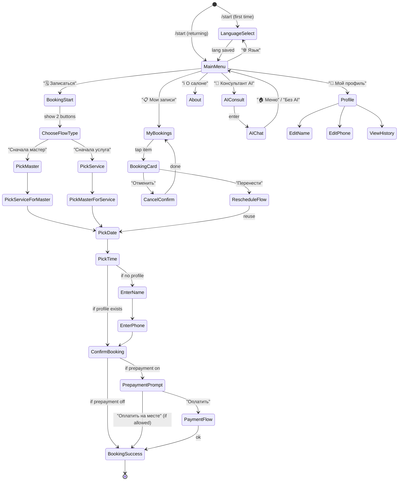

# Bot Flows — FSM и схемы Telegram-бота

Этот документ описывает **все** сценарии Telegram-бота: кнопки, сообщения, переходы, состояния. Используется как техзадание для разработчика и как источник правды при написании тестов.

---

## 0. Общие правила

1. **Inline-клавиатуры** на всех экранах (не reply-кнопки).
2. **Навигационные кнопки** на каждом экране:
   - `« Назад` — предыдущий шаг в рамках сценария.
   - `🏠 Меню` — сбрасывает FSM и возвращает в главное меню.
3. **Подтверждения действий** (отмена, удаление) — всегда двухступенчатые: `[✅ Да]  [❌ Нет]`.
4. **FSM хранится в Redis** (aiogram FSMContext → RedisStorage). Протухает через 2 часа бездействия.
5. **Таймауты:** если клиент не завершил запись за 30 минут — напоминание; за 2 часа — сценарий сбрасывается.
6. **Антиспам:** throttle middleware, макс 1 сообщение / 500 мс.
7. **Язык:** определяется из `client.lang`; если `NULL` — запускается выбор языка.

---

## 1. Дерево состояний (FSM)



---

## 2. Сценарий: первое открытие бота (язык)

### 2.1. Сообщение

```
🇬🇧 Welcome!  Please choose your language.
🇷🇺 Добро пожаловать! Пожалуйста, выбери язык.
🇺🇦 Ласкаво просимо! Будь ласка, обери мову.
🇧🇬 Добре дошли! Моля, изберете език.
```

### 2.2. Клавиатура

```
[🇬🇧 English]   [🇷🇺 Русский]
[🇺🇦 Українська] [🇧🇬 Български]
```

### 2.3. Логика

- Автовыбор подсказывается согласно `message.from_user.language_code`: соответствующая кнопка получает префикс ⭐.
- После клика: сохраняем `client.lang`, показываем Welcome + главное меню.

---

## 3. Сценарий: главное меню

### 3.1. Сообщение (RU пример)

```
Здравствуй, {first_name}! 👋
Чем могу помочь?
```

### 3.2. Клавиатура

Если AI включён в настройках:
```
[🗓  Записаться]
[📋  Мои записи]   [💬  AI-консультант]
[ℹ️   О салоне]    [👤  Профиль]
[🌐  Язык]
```

Если AI выключен:
```
[🗓  Записаться]
[📋  Мои записи]
[ℹ️   О салоне]    [👤  Профиль]
[🌐  Язык]
```

---

## 4. Сценарий записи — полный flow

```mermaid
flowchart TD
    A[Главное меню] --> B{Клик «🗓 Записаться»}
    B --> C[Спросить:<br/>«Как удобнее выбрать?»<br/>1: Сначала мастер<br/>2: Сначала услуга]
    C -->|1| D1[Список мастеров<br/>с фото, рейтингом]
    C -->|2| D2[Категории услуг]

    D1 --> E1[Список услуг<br/>которые делает мастер]
    D2 --> E2[Услуги внутри категории]
    E2 --> F2[Список мастеров<br/>кто делает эту услугу]

    E1 --> G[Выбор даты<br/>inline-календарь]
    F2 --> G

    G --> H[Выбор времени<br/>свободные слоты с шагом = длит. услуги]
    H --> I{Профиль заполнен?}
    I -->|Нет| J[Ввести имя]
    J --> K[Ввести телефон<br/>+ кнопка «поделиться контактом»]
    K --> L[Подтверждение]
    I -->|Да| L

    L --> M[Показать карточку:<br/>услуга, мастер, дата/время, цена<br/>кнопки: Подтвердить / Изменить / Отмена]
    M -->|Подтвердить| N{Предоплата вкл?}
    N -->|Да| O[Показать сумму + [Оплатить] [Отменить]]
    O --> P[Telegram Payments invoice]
    P -->|оплачено| Q[Успех: бронь создана, статус confirmed]
    N -->|Нет| Q
    O -->|Отмена| R[Бронь не создана]

    Q --> S[Сообщение: «Запись подтверждена! 🎉<br/>{дата} в {время}<br/>{мастер}<br/>Напомним за 24ч, 2ч и 30мин.»]
    S --> T[Кнопки: Мои записи / Главное меню]
```

### 4.1. Детали

**Выбор даты (inline-календарь):**
- Показывается месяц, можно листать ± 2 месяца.
- Дни без свободных слотов — серые, некликабельные.
- Дни полностью занятые — с крестиком.

**Выбор времени:**
- Слоты генерируются с шагом = `service.duration + settings.booking_buffer_minutes`.
- Занятые слоты скрыты.
- Если нет слотов: «Свободных слотов нет. Выбрать другой день?»

**Ввод телефона:**
- Есть кнопка «📱 Поделиться номером» (`KeyboardButton(request_contact=True)` — единственный случай reply-кнопок во всём боте).
- Валидация: E.164, +? с кодом страны.

**Карточка подтверждения:**
```
Проверьте запись:

💇 Услуга: Женская стрижка
👩 Мастер: Анна
📅 Дата: 20 апреля 2026, пн
🕐 Время: 14:30
💰 Цена: 45 EUR
⏱ Длительность: 1 ч

[✅ Подтвердить]
[✏️ Изменить]  [❌ Отменить]
[« Назад]  [🏠 Меню]
```

**Предоплата (если включена):**
```
Для подтверждения требуется предоплата 20% = 9 EUR.
Оплачивается через Telegram — мгновенно и безопасно.

[💳 Оплатить 9 EUR]
[« Назад]  [🏠 Меню]
```

После оплаты → `BookingSuccess` + сообщение с деталями.

---

## 5. Сценарий: «Мои записи»

```mermaid
flowchart TD
    A[Мои записи] --> B[Список будущих броней<br/>и последних 3 прошедших]
    B --> C{Клик по брони}
    C --> D[Карточка брони с кнопками]
    D --> E[Перенести]
    D --> F[Отменить]
    D --> G[Добавить в календарь .ics]
    D --> H[« Назад]

    F --> I{До визита >24ч?}
    I -->|Да| J[Подтвердить отмену]
    J -->|Да| K[Бронь отменена,<br/>деньги возврат, если предоплата]
    I -->|Нет| L[Показать политику:<br/>штраф / блэклист / нельзя]
    L --> M{Нельзя отменить?}
    M -->|Да| N[«Поздно отменять. Позвоните в салон.»]
    M -->|Нет, штраф| O[«Отмена повлечёт штраф X € при следующем визите.»<br/>[Отменить всё равно] [Назад]]
    M -->|Нет, blacklist| P[«Если отмените — попадёте в чёрный список.»]
```

### 5.1. Карточка прошедшей брони (если нет отзыва)

Внизу дополнительная кнопка `⭐ Оставить отзыв` → запускает `ReviewFlow`.

---

## 6. Сценарий: отзыв после визита

Через `review_delay_hours` (по умолчанию 2ч) после завершения брони — воркер шлёт клиенту:

```
👋 Как вам визит к {master.display_name} сегодня?
Оцените, пожалуйста. Это анонимно — мы не покажем ваше имя.

[⭐] [⭐⭐] [⭐⭐⭐] [⭐⭐⭐⭐] [⭐⭐⭐⭐⭐]
[🙅 Пропустить]
```

- После оценки: «Хотите добавить комментарий? (необязательно)»
- Текстовое поле → сохраняется в `review`.
- Сообщение: «Спасибо! Ваше мнение очень важно 💖».

---

## 7. Сценарий: AI-консультант

### 7.1. Вход

```
💬 Консультант AI

Я могу рассказать:
• о наших услугах и процедурах
• какая стрижка подходит для вашего типа волос
• уход после окрашивания
• и многое другое 💫

Просто напишите вопрос!

[🗓 Лучше записаться]
[🔕 Без AI — классическое меню]
[🏠 Меню]
```

### 7.2. Логика

- Любое текстовое сообщение от клиента в этом состоянии → `ai_service.ask(client, text)`.
- Ответ приходит стримом (для эффекта набора). aiogram: `await bot.send_chat_action("typing")`, затем текст.
- Под ответом кнопки: `[🗓 Записаться]  [👎 Плохой ответ]  [🏠 Меню]`.
- Если `👎` — помечается в `ai_message.flagged=True`.
- Кнопка `🔕 Без AI` → `client.prefers_no_ai = true` → главное меню без пункта AI.

---

## 8. Сценарий: Профиль

```
👤 Мой профиль

Имя: {first_name} {last_name}
Телефон: {phone}
Telegram: @{username}
Язык: {lang}
Всего визитов: {total_bookings}
Любимый мастер: {favorite_master or "—"}

[✏️ Изменить имя]
[📱 Изменить телефон]
[🌐 Сменить язык]
[🗑 Удалить мои данные]
[« Назад]
```

**Удаление:** двухступенчатое подтверждение. При подтверждении — GDPR-delete (анонимизация в БД, telegram-блок навсегда по `tg_user_id`).

---

## 9. Сценарий: «О салоне»

Статическая информация из настроек: название, адрес, часы, телефон, соцсети, фото.

```
💇 {salon.name}

📍 {address}
🕐 {hours}
☎️ {phone}
🌐 {website}

{description}

[🗺 Открыть на карте]
[📞 Позвонить]
[📸 Instagram]
[🏠 Меню]
```

---

## 10. Сценарий: Mini App

В главном меню опционально есть кнопка `🎨 Открыть салон` → запускает Mini App (`web_app` button) на URL `https://<domain>/mini-app`.

Внутри Mini App:
- Главная: витрина услуг (плитка с фото).
- Мастера: карточки с фото, рейтингом, био.
- Календарь записи: красивая сетка + слоты.
- По клику «Записаться» — `Telegram.WebApp.sendData(...)` → бот создаёт бронь.

---

## 11. Напоминания (исходящие)

Воркер ARQ каждые 5 минут сканирует `booking WHERE status='confirmed' AND starts_at BETWEEN now() AND now()+26h` и шлёт:

| Интервал | Текст |
|---|---|
| 24 ч | Напоминание + кнопки: [✅ Буду] [❌ Отменить] [📅 В календарь] |
| 2 ч | Короткое напоминание + [📍 Адрес] [📞 Позвонить] |
| 30 мин | Финальный пинг + [🚶 Уже в пути] |

Если клиент нажимает `❌ Отменить` — запускается стандартный cancel flow с учётом политики.

---

## 12. Ошибки и edge cases

| Кейс | Поведение |
|---|---|
| Бот не знает клиента (нет в БД) | Auto-create на `/start`, затем язык → меню |
| Слот занят, пока клиент думал | Показать «Извини, слот только что заняли. Выбрать другое время?» |
| Клиент в блэклисте | При попытке записи — «К сожалению, онлайн-запись недоступна. Обратитесь по телефону {phone}.» |
| Мастер заболел / расписание изменено | При открытии брони клиента — автоматический запрос «Нужно перенести» |
| AI недоступен (нет ключа / лимит) | «AI временно недоступен. Попробуйте позже или запишитесь напрямую.» |
| Платёж не прошёл | Бронь остаётся в `pending` 15 мин, потом отменяется автоматически |
| Переполнение FSM (Redis down) | Фоллбек: in-memory FSM, show баннер «Сервис частично недоступен» |
| Webhook Telegram сломан | `/healthz` упадёт, алерт |

---

## 13. Карта всех текстовых ключей для i18n (часть)

Храним в `backend/app/bot/texts/*/messages.ftl`:

```fluent
welcome-first = Добро пожаловать! Пожалуйста, выбери язык.
menu-greeting = Здравствуй, { $name }! 👋 Чем могу помочь?
menu-book = 🗓 Записаться
menu-my-bookings = 📋 Мои записи
menu-ai = 💬 AI-консультант
menu-about = ℹ️ О салоне
menu-profile = 👤 Мой профиль
menu-lang = 🌐 Язык

booking-choose-flow = Как удобнее выбрать?
booking-flow-master-first = Сначала мастер
booking-flow-service-first = Сначала услуга
booking-choose-master = Выбери мастера:
booking-choose-service = Выбери услугу:
booking-choose-date = Выбери дату:
booking-choose-time = Выбери время:
booking-no-slots = Свободных слотов нет 😔
booking-enter-name = Как тебя зовут?
booking-enter-phone = Оставь номер телефона (или поделись контактом):
booking-share-contact = 📱 Поделиться контактом
booking-confirm-title = Проверьте запись:
booking-confirm-btn = ✅ Подтвердить
booking-edit-btn = ✏️ Изменить
booking-cancel-btn = ❌ Отменить

booking-prepayment-required = Требуется предоплата { $amount } { $currency }.
booking-pay-btn = 💳 Оплатить { $amount } { $currency }

booking-success = Запись подтверждена! 🎉
    { $date } в { $time }
    Мастер: { $master }
    Напомним за 24ч, 2ч и 30 минут.

reminder-24h = Напоминаем: завтра в { $time } вы записаны к { $master } на «{ $service }».
reminder-2h = Через 2 часа — ваш визит к { $master }.
reminder-30m = Через 30 минут! Ждём вас 🌿

cancel-too-late = Слишком поздно для бесплатной отмены. { $policy_text }
cancel-confirm = Точно отменить запись?
cancel-success = Запись отменена. Надеемся увидеть вас снова 🌸

review-prompt = Как вам визит к { $master }? Оцените:
review-thanks = Спасибо за отзыв! 💖

ai-intro = Я могу рассказать о наших услугах, ценах, уходе…
    Просто напиши вопрос!
ai-no-ai-btn = 🔕 Без AI — классическое меню
ai-bad-answer = 👎 Плохой ответ

blacklist-blocked = К сожалению, онлайн-запись недоступна.
    Позвоните нам: { $phone }

error-generic = Что-то пошло не так. Попробуйте ещё раз или свяжитесь с салоном.
```

*(Полный набор ключей генерируется в ходе разработки; CI-агент `i18n-checker` следит за синхронностью всех 4 языков.)*

---

## 14. Нотификации админам (для бота-админ-канала, опционально)

Если в настройках включён `admin_notify_chat_id`, бот пишет в этот чат:
- 🟢 Новая бронь
- 🔴 Отмена поздняя (с именем клиента и политикой)
- ⚠️ Клиент в блэклисте пробовал записаться
- 👎 Пометка «плохой ответ AI»
- 💳 Оплата прошла / не прошла

Каждое сообщение — inline-кнопка «Открыть в админке» → deep-link в веб-панель.

---

---

## 15. Синхронизация каталога услуг с ботом

### 15.1. Как бот получает список услуг

Бот не хранит каталог услуг в коде — он загружает его из PostgreSQL и кеширует в памяти. При запуске (`on_startup`) запускается фоновая задача `subscribe_to_updates`, которая слушает Redis channel `services:updates`.

```
services:updates  (Redis Pub/Sub)
    │
    ├─ {"action": "hide",   "id": 42}   → убрать #42 из кеша
    ├─ {"action": "show",   "id": 42}   → добавить #42 в кеш
    ├─ {"action": "update", "id": 42}   → обновить #42 в кеше
    ├─ {"action": "delete", "id": 42}   → удалить #42 из кеша
    └─ {"action": "flush"}              → очистить весь кеш (full reload)
```

### 15.2. Поведение бота при изменении каталога

#### Сценарий A — Услуга скрыта администратором в момент выбора

Если клиент уже начал сценарий бронирования и услуга была скрыта **до того**, как он нажал «Записаться»:

```
[Admin] скрывает услугу → Redis Pub/Sub → бот инвалидирует кеш
[Client] нажимает «Записаться» → бот запрашивает активные услуги
                                → скрытая услуга не показывается
```

#### Сценарий B — Услуга скрыта в середине сессии бронирования

Клиент уже выбрал услугу (FSM state = `PickMaster`) — редкий race condition:

```
[Client] на шаге PickMaster
[Admin] скрывает выбранную услугу
[Client] выбирает мастера и нажимает «Подтвердить»
```

При финальном подтверждении API делает проверку: `service.is_active == true`. Если нет — возвращает ошибку 409, бот показывает:

```
Извините, эта услуга больше недоступна для записи.
Пожалуйста, выберите другую.
[Выбрать услугу]  [🏠 Меню]
```

FSM сбрасывается на шаг `PickService`.

#### Сценарий C — Добавлена новая услуга

```
[Admin] создаёт услугу → Redis PUBLISH {"action":"show","id":99}
[Client] открывает меню → получает обновлённый список с новой услугой
```

Без перезапуска бота, без деплоя.

### 15.3. Кеш-стратегия

| Ключ | TTL | Инвалидация |
|---|---|---|
| `services:list` | 5 мин | При любом изменении через Pub/Sub |
| `services:item:{id}` | 10 мин | При `update` / `hide` / `delete` конкретного ID |
| `service_categories:list` | 30 мин | При изменении категории |

Дополнительно: при `GET /api/v1/services` с параметром `?active_only=true` (бот использует этот эндпоинт) — результат кешируется в Redis с ключом `services:list:active`. При изменении любой услуги — ключ инвалидируется.

### 15.4. FSM states — связанные с каталогом услуг

```python
class BookingStates(StatesGroup):
    ChooseFlowType      = State()
    PickMaster          = State()   # data: selected_master_id
    PickServiceForMaster = State()  # data: selected_master_id
    PickService         = State()
    PickMasterForService = State()  # data: selected_service_id
    PickDate            = State()   # data: master_id, service_id
    PickTime            = State()   # data: master_id, service_id, date
    EnterName           = State()   # data: + time_slot
    EnterPhone          = State()   # data: + name
    ConfirmBooking      = State()   # data: full booking_data
    PrepaymentPending   = State()   # data: + payment_id
```

**Данные в FSMContext** (хранятся в Redis):

```json
{
  "flow_type": "service_first",
  "service_id": 12,
  "service_name": "Окрашивание (балаяж)",
  "service_price": 120,
  "service_duration": 180,
  "master_id": 3,
  "master_name": "Анна",
  "date": "2026-05-10",
  "time_slot": "14:00",
  "client_name": "Мария",
  "client_phone": "+359 88 123 4567"
}
```

При инвалидации кеша услуги данные уже сохранённые в FSMContext **не меняются** — это сделано намеренно, чтобы не прерывать активную сессию клиента. Проверка актуальности происходит только в момент финального подтверждения (`POST /api/v1/bookings`).

---

Конец `02_BOT_FLOWS.md`.
